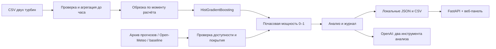

# Устройство MVP

- `data.py`: исходные CSV, часовая агрегация, пропуски, контроль времени.
- `weather.py`: контракт архива, инерционный baseline, live Open-Meteo.
- `model.py`: модель зависимости мощности от ветра и температуры.
- `service.py`: детерминированный цикл подготовки, погоды, обучения, расчёта, анализа и сохранения; исторический replay.
- `agent.py`: опциональный LLM-аналитик через Responses API с инструментами `inspect_forecast` и `inspect_data_quality`.
- `__main__.py`: CLI и периодический `watch`.
- `api.py`, `web/`: локальный интерфейс, история, выгрузка.

Это первая реализация агентного процесса: оркестратор выполняет фиксированные проверяемые
шаги; LLM самостоятельно вызывает инструменты анализа, но пока не выбирает модель и не
управляет обучением. Численные значения вычисляет sklearn, а не языковая модель.

## Время и обучение

`origin` — начало первого прогнозируемого часа. Используются только полностью завершённые
часы истории (`timestamp + 1h <= origin`). Обучение дополнительно ограничено началом
1 февраля 2026 в `DATA_TIMEZONE`, включая при live-прогнозе. Февральские цели никогда не
попадают в обучение, даже если их добавят в исходный CSV для оценки.

Последние 20% пригодной истории по времени используются для валидации, затем модель
переобучается на всей разрешённой истории. Погодные признаки — скорость ветра, её куб,
температура. Случайный внутренний early stopping отключён. Будущая мощность и будущие
измерения не являются входами прогноза.

Диапазон на графике = прогноз ± 90-й процентиль абсолютного остатка валидации с ограничением
0–1. Это диагностическая полоса ошибки преобразования ветра в мощность, **не калиброванный
90%-й прогнозный интервал**: она не покрывает ошибку погодного прогноза и изменение режима.

## Повторные расчёты и стоимость

Модели кешируются в памяти процесса по турбине, границе обучения и SHA-256 CSV. `watch`
периодически получает входы и рассчитывает результат; при неизменном fingerprint не
сохраняет повторный отчёт и не обращается к OpenAI. При изменении данных сохраняет новый
прогноз. `watch` не является установленной фоновой службой: его нужно запустить отдельно.

Live использует следующий полный час после получения погоды и сохраняет время получения.
Сменившийся час или погодный ряд приводит к новому fingerprint. По умолчанию интервал —
3600 секунд. Ручной расчёт всегда создаёт отдельный запуск, а отмеченный AI-анализ может
повторно расходовать кредиты.

OpenAI включается только флагом/чекбоксом. Лимит — 4 Responses-запроса по 600 выходных токенов
за анализ, с одним повтором SDK при временной ошибке. Это ограничение числа запросов,
не финансовый лимит аккаунта. Фактическая цена зависит от настроенной модели и токенов.
Полные CSV, почасовая история и ключ не отправляются в промпт: инструменты возвращают
сводку прогноза, метрики, название файла, SHA-256 и сведения об источнике погоды (включая
координаты в live-режиме). `store=False` отключает сохранение Responses application state;
это не обещание отсутствия других журналов провайдера.

## Ограничения первой версии

- Нужен проверенный архив оперативных прогнозов февраля; автоматического импортера GRIB пока нет.
- Не подтверждены часовой пояс CSV и высота измерения ветра. Фиксированный UTC+5 — явное допущение, включая 2023 год.
- Live-ветер на 100 м и измерения у турбины могут иметь систематическое смещение.
- Нет паспортной мощности: доступны доли номинала и эквивалентные часы полной нагрузки, без выдуманных МВт·ч.
- Модели раздельные для турбин; агрегирование ВЭС потребует номинальных мощностей.
- Модель обучена на доступном январском срезе; для промышленного live нужны свежие наблюдения и мониторинг дрейфа.
- Сервер рассчитан на localhost и одного пользователя, без аутентификации. Не публиковать его как есть.
