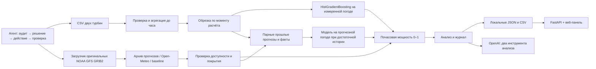

# Устройство WindPilot

- `data.py`: исходные CSV, часовая агрегация, пропуски, контроль времени.
- `weather.py`: контракт архива, инерционный baseline, live Open-Meteo.
- `weather_download.py`: загрузка оперативных GFS, декодирование, HTTP-доказательства доступности, SHA-256 и возобновление.
- `schedule.py`: единое расписание ежедневных выпусков и отдельное окно оценки февраля.
- `model.py`: модель на измеренном ветре и отдельная модель на парных архивных прогнозах при достаточной истории.
- `service.py`: детерминированный цикл подготовки, погоды, обучения, расчёта, анализа и сохранения; исторический replay.
- `agent.py`: опциональный LLM-аналитик через Responses API с инструментами `inspect_forecast` и `inspect_data_quality`.
- `workflow.py`: автономный контроллер полного кейса, проверка результатов и журнал решений.
- `__main__.py`: CLI, `run-case`, периодические `watch` и `run-case --watch`.
- `api.py`, `web/`: локальный интерфейс, история, выгрузка.

Контроллер — агент с явной политикой, а не свободно планирующий LLM. По наблюдаемому состоянию
он решает: загрузить/возобновить недостающую погоду, проверить доказательства, переиспользовать
неизменные результаты, пересчитать изменившиеся входы или остановиться при повреждении.
После каждого действия записывает причину и результат в JSON. Выбор численной модели
определяется доступной историей; LLM самостоятельно вызывает только инструменты анализа
и не управляет обучением. Мощность вычисляет sklearn, а не языковая модель.

## Время и обучение

`origin` — начало первого прогнозируемого часа. Используются только полностью завершённые
часы истории (`timestamp + 1h <= origin`). Обучение дополнительно ограничено началом
1 февраля 2026 в `DATA_TIMEZONE`, включая при live-прогнозе. Февральские цели никогда не
попадают в обучение, даже если их добавят в исходный CSV для оценки.

Последние 20% пригодной истории по времени используются для валидации, затем модель
переобучается на всей разрешённой истории. Базовые признаки — скорость ветра, её куб,
температура. Для архивной модели добавляется заблаговременность прогноза. Парные примеры
допускаются только если выпуск уже был доступен к началу прогнозируемого часа, а этот час
полностью завершился до `origin` и границы обучения. Разделение 80/20 проводится по
уникальным часам факта, так что один час из разных погодных выпусков не попадает одновременно
в обучение и проверку. При менее 240 парных часах или узком диапазоне заблаговременности
используется базовая модель.
Случайный внутренний early stopping отключён. Будущая мощность и будущие измерения не
являются входами прогноза.

Диапазон на графике = прогноз ± 90-й процентиль абсолютного остатка валидации с ограничением
0–1. Для базовой модели он не покрывает ошибку погоды; для архивной содержит часть такой
ошибки на прошлых выпусках. В обоих случаях это **не калиброванный 90%-й интервал**.

Replay сохраняет весь горизонт каждого ежедневного выпуска. Оценка ограничена отдельным
окном (`score_start`–`score_end`), поэтому январские и мартовские часы не создают ложную
февральскую метрику. Выпуски идут в 23:00 UTC+5 с 31 января по 28 февраля; берётся GFS
12:00 UTC с проверенной публикацией не позже 18:00 UTC. Сохраняются все 24/48 часов,
отдельно проверяются покрытие каждого из 672 февральских часов и доступность входов.
Сравнение с инерцией мощности последних шести наблюдённых часов выполняется только там,
где есть факт и baseline был доступен на момент выпуска. При 48 часах перекрытия соседних
выпусков считаются отдельными парами выпуск–час.

## Повторные расчёты и стоимость

`run-case` загружает 14 суток предтестовых прогнозов в отдельный архив. Последние три
предтестовых выпуска используются для rolling-проверки: каждая модель видит только
измерения, завершённые к соответствующему выпуску. Это отдельная оценка, не февральская.
Для основной модели обучение всегда ограничено началом февраля, даже при добавлении факта.

Fingerprint полного кейса включает SHA-256 SCADA и двух погодных CSV, Python-модули,
версии численных библиотек, часовой пояс, расписание и окно оценки. Неизменность выходных
CSV/JSON проверяется отдельно. `case-latest.json` обновляется только после успешного
завершения; неудача сохраняет отдельный журнал и не объявляется успешным прогнозом.
`run-case --watch` повторяет наблюдение с ограниченной задержкой при ошибках; явной
службой ОС не является. Повреждённая погода вызывает отказ, не переход на будущие факты.

Модели кешируются в памяти процесса по турбине, границе обучения и SHA-256 CSV;
архивная модель дополнительно зависит от SHA-256 погодного архива и семейства источника. `watch`
периодически получает входы и рассчитывает результат; при неизменном fingerprint не
сохраняет повторный отчёт и не обращается к OpenAI. При изменении данных сохраняет новый
прогноз. При ожидаемой ошибке входов или сети `watch` повторяет расчёт с ограниченной
экспоненциальной задержкой. `watch` не является установленной фоновой службой: его нужно
запустить отдельно.

Live использует следующий полный час после получения погоды и сохраняет время получения.
Сменившийся час или погодный ряд приводит к новому fingerprint. По умолчанию интервал —
3600 секунд. Ручной расчёт всегда создаёт отдельный запуск, а отмеченный AI-анализ может
повторно расходовать кредиты.

OpenAI включается только флагом/чекбоксом. Лимит — 4 Responses-запроса по 600 выходных токенов
за анализ, с одним повтором SDK при временной ошибке. Это ограничение числа запросов,
не финансовый лимит аккаунта. Фактическая цена зависит от настроенной модели и токенов.
Полные CSV, почасовая история и ключ не отправляются в промпт: инструменты возвращают
сводку прогноза, метрики, название файла, SHA-256 и сведения об источнике погоды (включая
координаты в live-режиме). `store=False` отключает сохранение Responses application state;
это не обещание отсутствия других журналов провайдера.

## Ограничения первой версии

- Без февральских измерений нельзя сообщить февральскую MAE/RMSE; опубликован только прогноз и предтестовая проверка.
- Первичная загрузка оригинальных GRIB требует нескольких гигабайт и доступа к NOAA S3; offline-проверка требует сохранить весь комплект.
- Предтестовые 14 суток — короткая выборка, не доказательство устойчивости к сезонному дрейфу.
- Не подтверждены часовой пояс CSV и высота измерения ветра. Фиксированный UTC+5 — явное допущение, включая 2023 год.
- Live-ветер на 100 м и измерения у турбины могут иметь систематическое смещение.
- Нет паспортной мощности: доступны доли номинала и эквивалентные часы полной нагрузки, без выдуманных МВт·ч.
- Модели раздельные для турбин; агрегирование ВЭС потребует номинальных мощностей.
- Модель обучена на доступном январском срезе; для промышленного live нужны свежие наблюдения и мониторинг дрейфа.
- Сервер рассчитан на localhost и одного пользователя, без аутентификации. Не публиковать его как есть.
